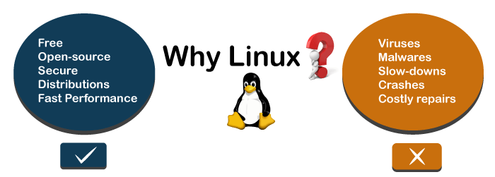

# INTRODUCTION TO LINUX

 
 **Linux** is a Kernel.

 **Kernel** is a code/program that used to meet your Software and Hardware. And allocate some resources.

 ● Users communicate with the *kernel* by the *shell*.

 # **What is Shell?**

*Shell*   is a Command Line Interpreter. 
 ● It translates commands entered by the user 
and converts them into a language that is understood by the Kernel.

 ## Types of shells
● Based on their features there are money shells.

        ○ SH
        ○ BASH
        ○ ZSH
        ○ FISH

> They differ in Colouring,Piping,command compilation, some kind of features.        

 ## OS- Operating system?
 > **OS** is  the main software part of computer that helps to work on.

●*It contains:*

        ○ Kernel
        ○ Softwares
        ○ Desktop environment
        ○ File extensions
        ○ Window manager

## Desktop Environment
### Types of desktop environment on linux
**A) Mate**

**B) Gnome**
-- Have beautiful animations, while opening,closing files
**C) KDE plasma**

**D) XFCE**

**Which Desktop environment is best?**

*Speed depends on:*

 >     ● Animations
 >     ● High Graphics
 >     ● Quality

# **Why Linux?**

**● FAST**

**● Most used**

**● Most hacking tools**

**● Most Secured!**

## *Linux distributions/distro*
 **Linux distribution (aka distro)** is an OS made from softwares based on the Linux kernel.

**● Distro** is Modified Linux Kernels,type of operating systems with different:

**-Linux Kernel**

**-Packages (GNU)**

**-Package manager**

**-Desktop UI**

There are so many Distros like:

● Debian

        ○ Kali linux
        ○ Ubuntu
        ○ Parrot
● Arch

        ○ Black arch
        ○ Garuda
● Fedora

● Red Hat

● Gentoo

● Android

## Which OS is best for hackers?
## **1. Kali linux**
Kali Linux is a Debian-derived Linux distribution designed for
digital forensics and penetration testing.
 
 It is maintained and funded by Offensive Security.

 ## *2. Parrot Os*
**Parrot OS** is a Linux distribution based on Debian with a focus on security, privacy, and development

## *3. Garuda*
**Garuda Linux** is a Linux distribution based on the Arch Linux operating
system.
## *4. Black Arch*
**BlackArch** is a free Linux based platform that contains a wide range of tools for automation, mobile, networking, etc.

 It is an open-source Operating System that is specially created for security researchers and penetration testers.

 ## Do windows have distros?
● Windows is not open-source so 
peoples won’t use / edit it, so there 
won’t be other kind.

● It just give updates and adds some 
feature on it.

**So… How can we use it?**

A) Main OS/ Main-boot

B) DualBoot / 2in1

C) Live boot

D) Cloud terminals

E) Virtual Machine

*● Computers* have a Technology called 
**“VIRTUALIZATION”.**
This is the 
method how it allocate our using 
memory to the virtual machines/ VM’s 

● This is a method to use windows and 
linux together.

● Softwares that gives you This ability:

        ○ HyberV
        ○ QEMU
        ○ Virtual Box - Oracle
        ○ VMware
        ○ …

F) WSL v2 / Windows Subsystem for Linux

G) Termux - Android